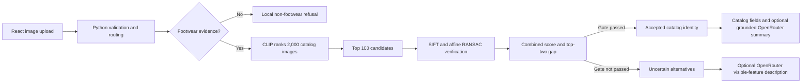

# ShoeLens product documentation

## Product purpose

ShoeLens helps a shopper move from a shoe photo to an inspectable record in a fixed product catalog. Its core product principle is that visual similarity is not automatically product identity. The interface therefore distinguishes a supported match from an uncertain result and a non-footwear refusal.

## Persona

**Mei** is a shopper who has saved a shoe photo but does not know its product name or catalog ID. She wants to locate the item and check basic catalog information without manually scanning hundreds of products. Mei is a design persona, not a user-study participant.

Her main needs are to upload a common image format, understand whether the result is confirmed or uncertain, compare the uploaded photo with the catalog source image, inspect supported catalog fields, and receive a clear refusal for non-footwear.

## Input

- One JPG, PNG, or WebP image
- A maximum upload size enforced by the local service
- A fixed searchable catalog of 2,000 footwear products

The input may be a known catalog shoe, footwear absent from the catalog, or a non-footwear image.

## Output

| Decision | User-facing output |
|---|---|
| Accepted match | Uploaded image, catalog source image, product ID, supported catalog fields, and an optional grounded summary |
| Uncertain shoe | A clear unconfirmed status, visually similar alternatives, and an optional description of visible features |
| Non-footwear | Local refusal with no product candidates and no remote image call |

An AI-generated description never upgrades an uncertain result into a confirmed identity.

## High-level architecture



## Responsibility boundaries

Local code validates uploads, routes non-footwear, computes CLIP retrieval and SIFT geometry, applies the frozen gate, retrieves catalog fields, validates generated claims, and decides accepted, uncertain, or refused. CLIP ViT-B/32 is the pretrained local visual encoder. OpenRouter is optional and generates constrained catalog explanations or visible-feature descriptions; it is not permitted to select or confirm identity.

Images used for optional remote description are resized and stripped of EXIF metadata before transmission. The feature still sends image content to an external model provider.

## Decision logic

CLIP narrows the 2,000-item gallery to 100 candidates. SIFT feature matching and affine RANSAC then measure local geometric agreement. The final score uses:

```text
0.7 × geometric support + 0.3 × CLIP cosine similarity
```

The system accepts an identity only when the combined score is at least 0.234958 and the top-one minus top-two score is at least 0.040742. These values were chosen on the 40-query calibration split and frozen before the 60-query held-out test. They are operating thresholds, not probabilities.

## Metrics targeted and reached

| Metric | Target | Reached |
|---|---:|---:|
| Calibration precision for accepted identities | ≥85% | 85.7% on 28 accepted calibration queries |
| Held-out known-item Top-1 | Reported, no fixed target | 97.6% (41/42) |
| Held-out accepted-answer accuracy | Reported with coverage | 97.6% (41/42 accepted answers) |
| Held-out answer coverage | Reported with accuracy | 70.0% (42/60) |
| Unknown/non-footwear false acceptance | Minimize | 0/18 in the small held-out subset |
| Median paired user-task time reduction | ≥50% | 53.6% with error penalty |
| User-task complete success | Improve over manual | 85% versus 65% manual |
| Retrieved-record claim support | 100% | 210/210 claims |
| Human-reviewed visible description fields | Reported | 36/36 confirmed by project owner |

Accepted-answer accuracy has an approximate 95% Wilson interval of 87.7%–99.6%, so the point estimate should not be treated as exact real-world performance.

## Product difference

A nearest-neighbor image search always has a first result, even when the correct item is missing. ShoeLens adds a calibrated evidence gate and makes uncertainty part of the product response. It also displays the catalog source image beside an accepted answer so the user can inspect the evidence. This reduces the risk of presenting visual similarity as a verified product fact.

## Current rough edges

- Test and study images are transformed catalog-origin photos rather than independent phone photographs.
- One wrong identity was accepted in the held-out test.
- The calibration set is small, and the 70/30 score weighting has not been established through a full ablation study.
- The user study includes five participants and a simplified 20-item manual interface.
- The catalog does not contain verified material, brand, authenticity, price, or detailed specification fields.
- Optional AI output adds network latency, cost, privacy considerations, and provider dependency.
- Human review of visual descriptions was performed by the project owner rather than independent blinded reviewers.

## Future path

The next study should photograph 10–15 catalog shoes with a phone under varied angles, backgrounds, distances, and lighting, with 3–5 images per shoe. It should add at least five visually similar shoes absent from the catalog. The main safety metric should be false confirmation of out-of-catalog shoes, alongside known-item accuracy and coverage. A new calibration subset should be used for threshold tuning, and the final phone-photo test must remain unopened until thresholds are frozen.

Further work should recruit a larger participant group, compare against a more realistic shopping interface, measure full browser-to-result latency, independently review AI descriptions, and test whether showing the source image helps users catch incorrect matches.
